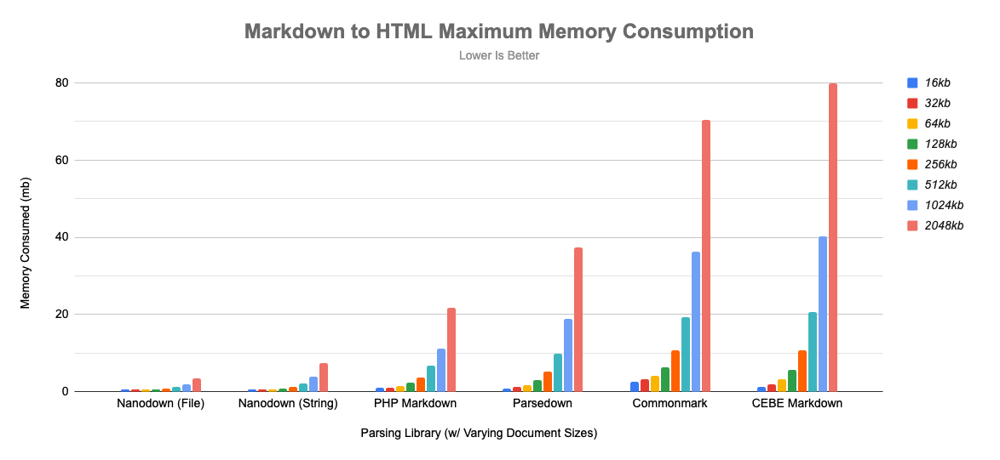
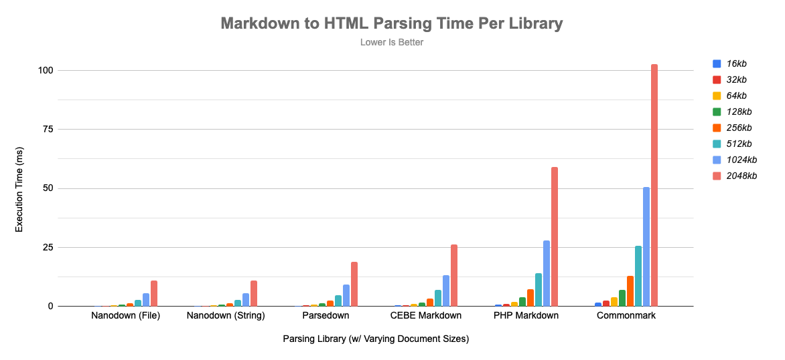

# Benchmarks

## Testing Methodology

### Hardware / Software
- M2 Max MacBook Pro (Mac14,5)
- PHP 8.2 (With PCRE Extensions)

### Documents
- Uses document located here: [Acid Document](acid.md).
    - Note: I will post the benchmark I wrote in a seperate repo as to not clutter this one.
- For document sizes this document is just repeated until the size criteria is met. **This means that file sizes are approximate.**

### Calculations
- Time starts when all libraries are loaded and ready to start processing.
- Time ends when parsing is complete.
- Memory is calculated using `memory_get_peak_usage` function.

### Library Considerations
I attempted to keep this as fair as possible by using the set with the features that matched mine. Unfortunately this isn't 1:1 and furthermore makes their case worse if I bump the feature set when it comes to execution time and memory consumption.

- CEBE Markdown: `new \cebe\markdown\GithubMarkdown()`
- Parsedown: `new Parsedown();`
- PHP Markdown: `Michelf\MarkdownExtra::defaultTransform();`
- Commonmark: `new CommonMarkConverter();`

### Other Notes
Since all of the other libraries do not natively support loading from a file *directly*, markdown is loaded into the memory buffer using `file_get_contents` and then parsed into html. However, to be fair, I have split my benchmark into  `String` and `File` for better comparative analysis.

## Analysis

### Memory Usage (Lower Is Better)

|Library|16kb|32kb|64kb|128kb|256kb|512kb|1024kb|2048kb|
|-|-|-|-|-|-|-|-|-|
|Commonmark|2.62mb|3.13mb|4.21mb|6.36mb|10.66mb|19.28mb|36.24mb|70.45mb|
|Parsedown|0.92mb|1.20mb|1.78mb|2.93mb|5.24mb|9.86mb|18.95mb|37.32mb|
|PHP Markdown|0.96mb|1.14mb|1.51mb|2.25mb|3.73mb|6.73mb|11.24mb|21.82mb|
|CEBE Markdown|1.32mb|1.94mb|3.19mb|5.70mb|10.67mb|20.64mb|40.29mb|79.90mb|
|Nanodown (String)|0.53mb|0.56mb|0.67mb|0.89mb|1.32mb|2.20mb|3.91mb|7.40mb|
|Nanodown (File)|0.53mb|0.53mb|0.54mb|0.63mb|0.81mb|1.18mb|1.90mb|3.37mb|

### Execution Time (Lower Is Better)

|Library|16kb|32kb|64kb|128kb|256kb|512kb|1024kb|2048kb|
|-|-|-|-|-|-|-|-|-|
|Commonmark|1.53ms|2.33ms|3.92ms|7.00ms|13.06ms|25.74ms|50.65ms|102.82ms|
|Parsedown|0.27ms|0.42ms|0.70ms|1.27ms|2.43ms|4.80ms|9.39ms|18.79ms|
|PHP Markdown|0.71ms|1.14ms|2.01ms|3.74ms|7.16ms|14.15ms|28.02ms|59.15ms|
|CEBE Markdown|0.35ms|0.55ms|0.92ms|1.73ms|3.39ms|6.96ms|13.10ms|26.36ms|
|Nanodown (String)|0.13ms|0.22ms|0.40ms|0.75ms|1.43ms|2.81ms|5.53ms|11.00ms|
|Nanodown (File)|0.13ms|0.22ms|0.40ms|0.74ms|1.42ms|2.79ms|5.50ms|10.94ms|

### Feature Set Comparison

A comparison of features from the rendered output from each library of the acid document described above. Screenshots of each rendering is included as proof.

| Feature | Commonmark | Parsedown | PHP Markdown | CEBE Markdown | Nanodown |
|-|-|-|-|-|-
|Headings|✅|✅|✅|✅|✅
|Italic|✅|✅|✅|✅|✅
|Bold|✅|✅|✅|✅|✅
|Bold/Italic|✅|✅|✅|✅|✅
|Lists|✅|✅|✅|✅|✅
|Nested Lists|✅|✅|✅|✅|✅
|Images|✅|✅|✅|✅|✅
|Urls|✅|✅|✅|✅|✅
|Code|✅|✅|✅|✅|✅
|Paragraphs|✅|✅|✅|✅|✅
|Horizontal Rules|✅|✅|✅|✅|✅
|Inline Code|✅|✅|✅|✅|✅
|Code Blocks|✅|✅|✅|✅|✅
|Tables|❌|✅|✅|✅|✅
|Subscript|❌|❌|❌|❌|✅
|Superscript|❌|❌|❌|❌|✅
|Highlight|❌|❌|❌|❌|✅
|Strikethru|❌|✅|❌|✅|✅
|Escape Characters|✅|⚠️|⚠️|⚠️|✅
|URLs Extended|⚠️|⚠️|⚠️|⚠️|✅
|Definition Lists|❌|❌|✅|❌|⚠️
|HTML|✅|✅|✅|✅|⚠️
|Screenshot|[Link](images/screenshots/commonmark.jpg)|[Link](images/screenshots/parsedown.jpg)|[Link](images/screenshots/php-markdown.jpg)|[Link](images/screenshots/cebe-markdown.jpg)|[Link](images/screenshots/nanodown.jpg)
