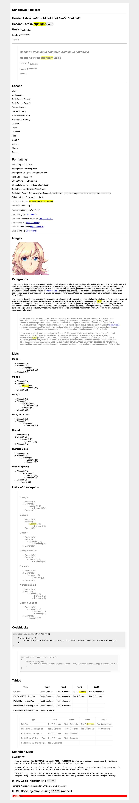

## About

The smallest and most efficient markdown parser available for PHP with an absolutely stunning amount of syntax support considering its size.

I was working on my own CMS (that uses markdown) and noticed that the markdown parser libraries for PHP are super chonky and memory intensive. This library is the fruits of my frustration. Enjoy!

## Features

- Single file include.
- Fast and memory efficient (by orders of magnitudes if you compare other libraries, see benchmarks below).
- Supports loading markdown by file or string.
- Easy to use syntax with zero configuration required.
- Easy to install by downloading a single file or using composer.
- No external dependencies.

## Getting Started

### Install

#### Composer
```
composer require celestinadragoni/nanodown
```

#### Manual Install
Download [src/nanodown.php](src/nanodown.php)
```
require_once('nanodown.php');
```

### Usage

#### Parse String Buffer
```
$md = <<<EOF
# Almighty Tallest
It’s not stupid, it’s advanced....
EOF;
$html = \Nanodown::getInstance()->convertFromString($md);
```

#### Parse File
```
$html = \Nanodown::getInstance()->convertFromFile('docs/file.md');
```

### Development / Live Server
Use this as a playground or as testing if you want to do development.

```
git clone git@github.com:CelestinaDragoni/nanodown.git
cd ./nanodown
composer server

localhost:8000 (Acid Test)
localhost:8000?readme (Readme Example)
```

## Supported Markdown
This library supports most of the useful features that people use markdown for such as writing in github or confluence. Below is a exhaustive list of supported features.

### Markdown Basic
| Syntax | Support  | Notes |
|-|-|-|
|Headings | ✅ | Alternative syntax is unsupported.
|Italic | ✅ |
|Bold | ✅ |
|Bold/Italic| ✅ |
|Blockquotes| ✅ | Nested blockquotes is unsupported.
|Lists| ✅ | |
|Nested Lists| ✅ | |
|Images|✅ | |
|URLs|✅ | |
|Code|✅ | |
|Horizontal Rule|✅ |
|HTML|⚠️| Requires wrapping HTML/Raw syntax in `^^^^^`.

### Markdown Extended
| Syntax | Support  | Notes |
|-|-|-|
|Subscript|✅| |
|Superscript|✅|
|Strikethru|✅|
|Highlight|✅|
|Table|✅| Alignment is unsupported.
|Code Blocks|✅|
|Escape Characters|✅ |
|URLs Extended|✅ |
|Definition Lists |⚠️ | Uses a non-standard method of doing this by wrapping a definition in a `span`. This allows you to style a definition as you desire.


## Comparison Benchmarks

### Testing Methodology

#### Hardware / Software
- M2 Max MacBook Pro (Mac14,5)
- PHP 8.2 (With PCRE Extensions)

#### Documents
- Uses document located here: [acid document](docs/acid.md).
    - Note: I will post the benchmark I wrote in a seperate repo as to not clutter this one.
- For document sizes this document is just repeated until the size criteria is met. **This means that file sizes are approximate.**

#### Calculations
- Time starts when all libraries are loaded and ready to start processing.
- Time ends when parsing is complete.
- Memory is calculated using `memory_get_peak_usage` function.

#### Library Considerations
To keep things fair I picked variations that advertised to give similar features to my own library.

- CEBE Markdown: `new \cebe\markdown\GithubMarkdown()`
- Parsedown: `new Parsedown();`
- PHP Markdown: `Michelf\MarkdownExtra::defaultTransform();`
- Commonmark: `new CommonMarkConverter();`

#### Other Notes
Since all of the other libraries do not natively support loading from a file *directly*, markdown is loaded into the memory buffer using `file_get_contents` and then parsed into html. However, to be fair, I have split my benchmark into  `String` and `File` for better comparative analysis.

### Analysis

#### Memory Usage (Lower Is Better)

|Library|16kb|32kb|64kb|128kb|256kb|512kb|1024kb|2048kb|
|-|-|-|-|-|-|-|-|-|
|Commonmark|2.62mb|3.13mb|4.21mb|6.36mb|10.66mb|19.28mb|36.24mb|70.45mb|
|Parsedown|0.92mb|1.20mb|1.78mb|2.93mb|5.24mb|9.86mb|18.95mb|37.32mb|
|PHP Markdown|0.96mb|1.14mb|1.51mb|2.25mb|3.73mb|6.73mb|11.24mb|21.82mb|
|CEBE Markdown|1.32mb|1.94mb|3.19mb|5.70mb|10.67mb|20.64mb|40.29mb|79.90mb|
|Nanodown (String)|0.53mb|0.56mb|0.67mb|0.89mb|1.32mb|2.20mb|3.91mb|7.40mb|
|Nanodown (File)|0.53mb|0.53mb|0.54mb|0.63mb|0.81mb|1.18mb|1.90mb|3.37mb|

#### Execution Time (Lower Is Better)

|Library|16kb|32kb|64kb|128kb|256kb|512kb|1024kb|2048kb|
|-|-|-|-|-|-|-|-|-|
|Commonmark|1.53ms|2.33ms|3.92ms|7.00ms|13.06ms|25.74ms|50.65ms|102.82ms|
|Parsedown|0.27ms|0.42ms|0.70ms|1.27ms|2.43ms|4.80ms|9.39ms|18.79ms|
|PHP Markdown|0.71ms|1.14ms|2.01ms|3.74ms|7.16ms|14.15ms|28.02ms|59.15ms|
|CEBE Markdown|0.35ms|0.55ms|0.92ms|1.73ms|3.39ms|6.96ms|13.10ms|26.36ms|
|Nanodown (String)|0.13ms|0.22ms|0.40ms|0.75ms|1.43ms|2.81ms|5.53ms|11.00ms|
|Nanodown (File)|0.13ms|0.22ms|0.40ms|0.74ms|1.42ms|2.79ms|5.50ms|10.94ms|

#### Feature Set Comparison

These are a comparison from the rendered output of the [acid document](docs/acid.md).

| Feature | Commonmark | Parsedown | PHP Markdown | CEBE Markdown | Nanodown |
|-|-|-|-|-|-
|Headings|✅|✅|✅|✅|✅
|Italic|✅|✅|✅|✅|✅
|Bold|✅|✅|✅|✅|✅
|Bold/Italic|✅|✅|✅|✅|✅
|Lists|✅|✅|✅|✅|✅
|Nested Lists|✅|✅|✅|✅|✅
|Images|✅|✅|✅|✅|✅
|Urls|✅|✅|✅|✅|✅
|Code|✅|✅|✅|✅|✅
|Paragraphs|✅|✅|✅|✅|✅
|Horizontal Rules|✅|✅|✅|✅|✅
|Inline Code|✅|✅|✅|✅|✅
|Code Blocks|✅|✅|✅|✅|✅
|Tables|❌|✅|✅|✅|✅
|Subscript|❌|❌|❌|❌|✅
|Superscript|❌|❌|❌|❌|✅
|Highlight|❌|❌|❌|❌|✅
|Strikethru|❌|✅|❌|✅|✅
|Escape Characters|✅|⚠️|⚠️|⚠️|✅
|URLs Extended|⚠️|⚠️|⚠️|⚠️|✅
|Definition Lists|❌|❌|✅|❌|⚠️
|HTML|✅|✅|✅|✅|⚠️
|Screenshot|[Link](docs/screenshots/commonmark.webp)|[Link](docs/screenshots/parsedown.webp)|[Link](docs/screenshots/php-markdown.webp)|[Link](docs/screenshots/cebe-markdown.webp)|[Link](docs/screenshots/nanodown.webp)

## Feature Requests and Issues Policy

The policy for this is simple.

- Issues relating to security or bugs are accepted and will be addressed accordingly.
- Issues relating to performance will be on a case-by-case basis depending on the severity (or if it's in scope).
- Issues relating to PHP versions at or above 7.4 will be addressed, anything below will be immediately rejected.
- Issues relating to code quality will be reviewed.
- Additional features may be considered if they do not bloat the library or defeat its purpose.

My time is limited, if you're interested in becoming a maintainer make an issue ticket and we will go from there.

## Update Policy
This is a markdown parsing engine, it is likely it won't get updated past a certain point of optimization. This does not mean it is abandoned. I will archive this repo if it does so.

## Changelog
Application changes can be found [here](changelog.md).

## License
This system uses the GNU GPLv3 to prevent corpo miscreants from yanking my code without contributing. You can read the license [here](license.md).

## Screenshot

