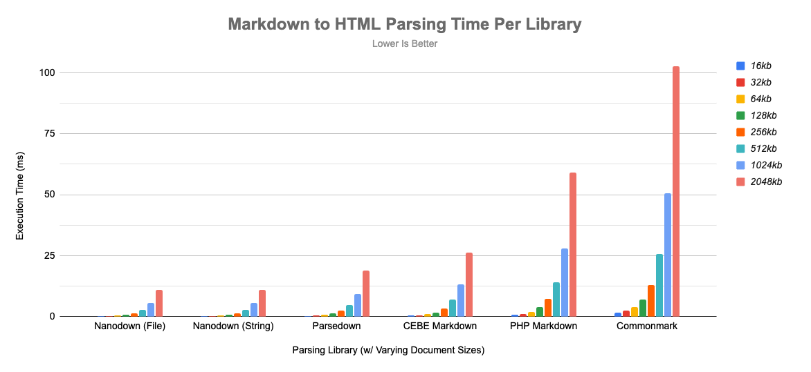

# Nanodown
The smallest and most efficient markdown parser available for PHP with both basic and extended markdown support.

## About

While I was working on my own CMS (that uses markdown), I noticed that all of the markdown parser libraries for PHP are super chonky and memory intensive. Some of the libraries required massive amount of includes, external deps, excessive namespace imports, and weird initialization syntax and configuration. While most people don't care about this; ***I do*** and decided to solve the problem. The library is extremely small (approx, `16kb`), a single file, and extremely easy to use and get started.

## Features

- Single file include.
- Supports most basic and extended markdown syntaxes and features.
- Fast and memory efficient.
- Supports loading markdown by file or string.
- Easy to use syntax with zero configuration required.
- Easy to install by downloading a single file or using composer.
- No external dependencies.

## Getting Started

### Install

#### Composer
```
composer require celestinadragoni/nanodown
```

#### Manual Install
Download [src/nanodown.php](src/nanodown.php)
```
require_once('nanodown.php');
```

### Usage

#### Parse String Buffer
```
$md = <<<EOF
# Almighty Tallest
It’s not stupid, it’s advanced....
EOF;
$html = \Nanodown::getInstance()->convertFromString($md);
```

#### Parse File
```
$html = \Nanodown::getInstance()->convertFromFile('docs/file.md');
```

## Development Playground
Want to try out the library first? Use the playground tool to mess around locally without any fuss. [Screenshot](docs/images/playground.png)

```
git clone git@github.com:CelestinaDragoni/nanodown.git
cd ./nanodown
composer server
```

In your browser go to `localhost:8000` and have fun. You can simply add new docs to the root of the checkout and they will show up in the sidebar.

**A small shoutout to something awesome**: The playground interface uses the [Catppuccin](https://github.com/catppuccin/catppuccin) color scheme. You should check it out!

## Comparison Benchmarks
To see the benchmark methodology, raw data, and feature set comparison [click here](docs/benchmarks.md).




## Supported Markdown
This library supports most of the useful features that people use markdown for such as writing in github or confluence. To see example output that showcases all of the supported features [click here](docs/images/acid.jpg).

| Syntax | Support  | Notes |
|-|-|-|
|Headings | ✅ | Alternative syntax is unsupported.
|Italic | ✅ |
|Bold | ✅ |
|Bold/Italic| ✅ |
|Blockquotes| ✅ | Nested blockquotes is unsupported.
|Lists| ✅ | |
|Nested Lists| ✅ | |
|Images|✅ | |
|URLs|✅ | |
|Code|✅ | |
|Horizontal Rule|✅ |
|Subscript|✅| |
|Superscript|✅|
|Strikethru|✅|
|Highlight|✅|
|Table|✅| Alignment is unsupported and ignored.
|Code Blocks|✅|
|Escape Characters|✅ |
|URLs Extended|✅ |
|Definition Lists |⚠️ | Uses a non-standard method of doing this by wrapping a definition in a `span`. This allows you to style a definition as you desire.
|HTML|⚠️| Requires wrapping HTML/Raw syntax in `^^^^^`.

## Feature Requests and Issues Policy

The policy is simple.

- Issues relating to security or bugs are accepted and will be addressed accordingly.
- Issues relating to performance will be on a case-by-case basis depending on the severity (or if it's in scope).
- Issues relating to PHP versions at or above 7.4 will be addressed, anything below will be immediately rejected.
- Issues relating to code quality will be reviewed.
- Additional features may be considered if they do not bloat the library or defeat its purpose.

My time is limited, if you're interested in becoming a maintainer make an issue ticket and we will go from there.

## Update Policy
This is a markdown parsing engine, it is likely it won't get updated past a certain point of optimization. This does not mean it is abandoned. I will archive this repo if it does so.

## Changelog
Application changes can be found [here](changelog.md).

## License
This system uses the GNU GPLv3 to prevent corpo miscreants from yanking my code without contributing. You can read the license [here](license.md).

